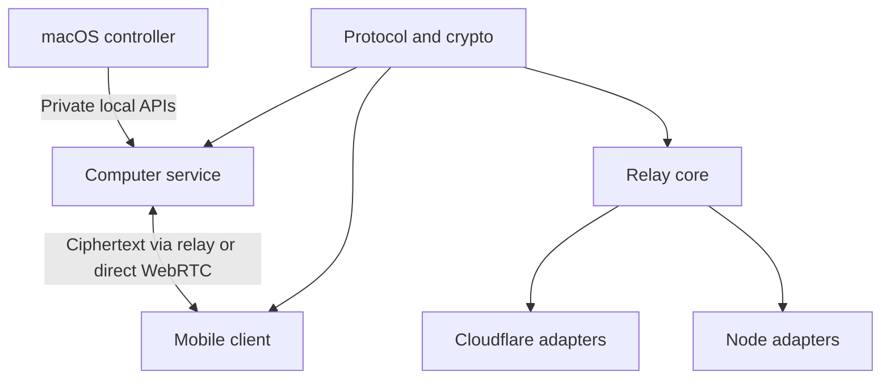

# Architecture overview

Shellbell continues computer terminal sessions from a paired phone. The computer
service owns the terminals and encryption keys; the relay coordinates connections
and push delivery. Terminal processes keep running on the computer.

| Component | Runs where | Responsibility |
| --- | --- | --- |
| Computer service | Per OS user on macOS or the headless Linux path | Terminal discovery, capture/input, identity, pairing, encryption and attention detection |
| Desktop controller | macOS | Pairing, settings, desktop-owned service lifecycle and optional power controls |
| Mobile client | Android / iOS | Pairing, terminal viewing/input and native notification presentation |
| Relay | Cloudflare Worker with SQLite Durable Objects, or one Node process with local SQLite | Authentication, ciphertext routing, pairing metadata, revocation and bounded push jobs |
| Push provider | Direct FCM / APNs | Background delivery attempts; acceptance does not prove display |

## Dependency boundaries

`packages/protocol` owns wire schemas, crypto and the terminal model.
`packages/relay-core` owns relay policy through runtime ports. Applications depend
on these packages rather than importing another application's implementation.
Cloudflare and Node adapters provide transport, storage and scheduling.

The terminal registry accepts bounded, owner-enabled local adapters and separates
session engines from desktop-window launchers. The encrypted catalog supplies
phone labels and capabilities; the relay needs no terminal-specific changes.
[Terminal adapters](terminal-adapters.md) defines the contract and trust boundary.
[Extensibility](extensibility.md) records the remaining constraints.

## Session flow

1. **Pair:** a temporary QR gate and pairing secret establish the endpoints'
   identities; the computer owner approves the phone. Public pairing metadata
   goes to the relay, while pairing keys stay on the endpoints.
2. **View:** the phone subscribes to a session. The service captures and encrypts
   bounded output/history; the active transport carries it to the phone.
3. **Type:** the service authenticates input, checks session ownership and
   dispatches it to the backend. An acknowledgement means backend acceptance,
   not command success. Uncertain input is never automatically replayed.
4. **Notify:** local attention detection creates recipient-specific notification
   work. The relay journals bounded provider attempts. Private context is
   decrypted by native phone receivers.

Normal mobile connections negotiate WebRTC through encrypted relay signaling,
verify the native DTLS certificate, perform a fresh Noise handshake and commit a
direct terminal route. Terminal input and subscriptions wait for direct readiness;
temporary encrypted relay terminal fallback requires an explicit user choice.
The relay remains connected for coordination, notification enrollment and retry
signaling. See [connections](../how-shellbell-connects.md),
[direct transport](direct-transport.md) and [capacity](relay-capacity.md).

## Trust and lifecycle

Pairing grants control of sessions exposed by the computer's OS user. There is
no general read-only role, per-command approval, organization login or centralized
device administration. The relay sees relationships, names, timing, sizes and push
routing metadata, while terminal content and private notification context remain
encrypted. [PRIVACY.md](../../PRIVACY.md) is the data-inventory authority.

A sleeping or offline computer cannot serve terminals. Desktop-owned services
end with their owning controller; headless services belong to the OS user manager.
Opening or quitting the desktop app does not adopt or stop a headless installation.
Host identities, pairing keys and revocations must survive upgrades deliberately.

## Detailed references

- [Design and security boundaries](design.md)
- [Computer service and backends](computer-agent.md)
- [Native controller](native-controller.md)
- [Mobile terminal](mobile-terminal.md)
- [Relay routing and retention](relay.md)
- [Relay runtime ports](relay-portability.md)
- [Relay storage and recovery](relay-storage.md)
- [Direct transport](direct-transport.md) and [secure v2 wire profile](direct-transport-wire-v2.md)
- [Private notifications](../private-notifications.md)
- [Generated wire protocol](../protocol.md), [bounded history](../stream-history-records.md) and [local control](../local-control-v2.md)

Use [self hosting](../self-hosting.md), [macOS](../../apps/macos/README.md),
[Linux](../../apps/linux/README.md) and [local mobile builds](../local-mobile-releases.md)
for operational commands. The [release checklist](../before-first-release.md) owns
qualification status; source conformance is separate from signing, hardware,
provider delivery and production deployment.
