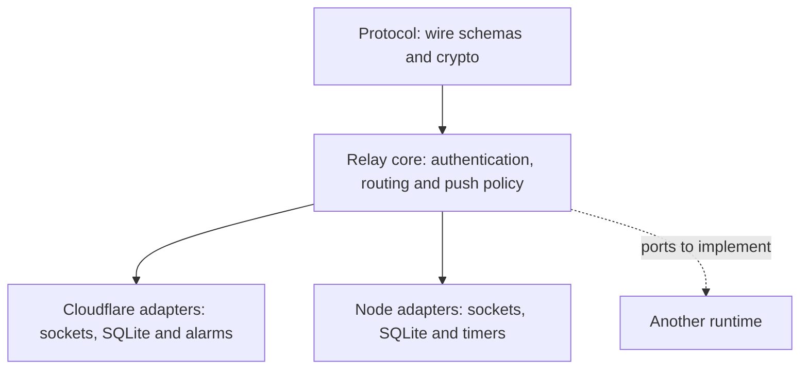

# Relay runtimes and adapters

The relay policy is shared; Cloudflare is one host for it. An organization can run
the supplied standalone relay on its own server without a Cloudflare account.
A different runtime or database needs an adapter and qualification, not a change
to where terminal plaintext is trusted.

## Supplied implementations

| Host | Coordination and storage | Deployment guide |
| --- | --- | --- |
| Cloudflare Workers | One SQLite backed Durable Object per computer; hibernating WebSockets and alarms | [Cloudflare self hosting](self-hosting.md#deploy-to-your-cloudflare-account) |
| Node 22.23.1 | One process, per computer coordinators, private local SQLite volume and persisted deadlines | [Docker and TLS](self-hosting.md#standalone-container) or [Node runtime](../apps/relay-node/README.md) |
| Other runtime or database | New adapter or protocol implementation; not supplied or qualified | Contracts below |

The Node image can run on a VM or a container host that supplies the required
local durable filesystem semantics, TLS and one writer. A managed platform with
ephemeral disks or automatic replicas needs a different storage/ownership design.
The current SQLite runtime cannot run as a fleet sharing a network filesystem.
In an orchestrator, use one instance and validate volume ownership, shutdown and
exclusive access on that actual platform. Do not infer support from a Docker build.

## Code boundaries

`packages/protocol` owns the wire and crypto contracts. `packages/relay-core` has
no Workers types, Node builtins, SQL driver or application import. Its ports are
implemented by `apps/relay/src/adapters` and `apps/relay-node/src`. Runtime composition
owns sockets, storage, task lifetime and provider I/O. Relay policy does not decrypt
terminal content or SDP/ICE signaling.

## Requirements for another TypeScript runtime

| Port | Required behavior |
| --- | --- |
| `RelayTransport` | Fresh generation ownership, detached session records, bounded sends, immediate retirement and idempotent close/error callbacks |
| `IdentityStore` | Computer scoped reads; atomic pairing limits, revocation tombstones and synchronization; durable pair IDs |
| `NotificationStore` | Atomic admission budgets, attempt reservations, claims and generation/expiry fencing; recovery after interruption |
| `WakeupScheduler` | Persist the earliest deadline; recover work after restart; do not lose an earlier security deadline behind provider work |
| `NotificationProvider` | Direct provider requests with bounded bodies/deadlines and classified outcomes; never retain terminal plaintext |
| `RuntimeServices` | Time, secure randomness, IDs and sanitized diagnostic categories |

Implement each repository operation as one complete atomic invariant. Replacing
SQLite with Postgres or another store is not a generic CRUD translation. Multiwriter
ownership, serializable budget admission, revocation precedence and stale completion
fencing need a design and tests. Durable queues must never become input replay queues.

Keep separate inbound and outbound budgets. Retain credits until accepted work
settles, even if its socket closes. Respect the configured frame, handler, pairing
and job limits. Platform or kernel buffers are outside those reservations; apply
edge admission controls too.

Cloudflare handlers await their full event/alarm lifetime. Node can track provider
delivery separately from local maintenance and fences it at shutdown. A third host
must define its own lifetime rules explicitly. Copying `waitUntil` or detaching a
promise does not establish durability.

## Other languages

Another language can implement the relay wire contract without importing TypeScript.
Use the language neutral fixtures in [relay conformance support](../packages/relay-core/test-support/README.md),
the [wire reference](protocol.md) and the [v2 wire profile](architecture/direct-transport-wire-v2.md).
The shared core is an implementation, not a requirement to use one language.

Conformance includes literal byte forwarding, challenge authentication, role authority,
pairing, replacement, revocation and recovery. The JSON transcripts do not replace
storage fault tests, queue bounds or real provider/device qualification. Never parse
or expose decrypted SDP, terminal output or input at the relay.

## Adapter qualification

1. Run shared transcript and repository contracts against the real runtime and store.
2. Test concurrent admission, stale authentication, connection replacement, queued
   write failure, disconnect broadcasts and bounded overload.
3. Interrupt every budget/claim transition; restart and prove durable recovery,
   revocation precedence and generation fenced completion.
4. Test deadlines while provider calls are held, then shutdown and late results.
5. Qualify TLS/proxy behavior, target volumes, backup/restore and upgrades.
6. Pair approved test devices and verify terminal traffic, push and direct/fallback
   behavior. Measure the intended load before publishing capacity claims.

See [portability details](architecture/relay-portability.md) for the current contracts
and [organization operations](organization-relay.md) for ownership and rollout.
